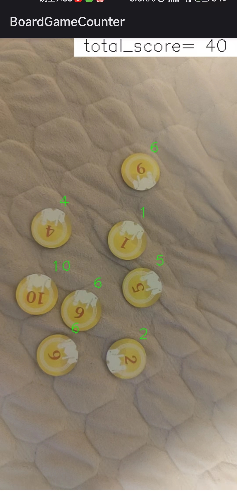

# BoardGameScorer-for-Android

This is an app that calculates board game scores by using the device's camera. It can recognize the game board, automatically detect tokens, and calculate the score.

## How to use

Using the app is straightforward. Simply launch it and point the camera at the game board. The app will automatically detect the tokens and calculate the score. You can view the score and game state in the app.

## Screenshot

## TODO

- [ ] Support multiple board games and token types.

- [ ] Implement ncnn multi-image inference to improve frame rate. 
- [ ] Design visually appealing UI.

## Acknowledgements

https://github.com/meiqua/shape_based_matching

https://github.com/FeiGeChuanShu/ncnn-android-yolox

https://github.com/Tencent/ncnn

https://github.com/nihui/opencv-mobile
